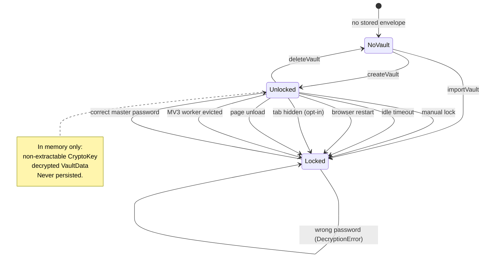

# Keyhole — Architecture

## Module layout

```mermaid
graph TD
  subgraph core["@keyhole/core — pure, no I/O"]
    crypto["crypto.ts<br/>Argon2id · AES-GCM · AAD"]
    vault["vault.ts<br/>create · unlock · save · re-key · CRUD"]
    sync["sync.ts<br/>envelope LWW compare"]
    types["types.ts"]
    validation["validation.ts<br/>zod schemas"]
    gen["password-gen.ts"]
    urlmatch["url-match.ts<br/>autofill matching"]
    psl["public-suffix.ts<br/>registrable domain, fail-closed"]
    totp["totp.ts<br/>RFC 6238"]
    health["health.ts<br/>offline audit"]
    breach["breach.ts<br/>HIBP k-anonymity (no I/O)"]
  end

  subgraph app["@keyhole/app — the renderer"]
    useVault["useVault.ts<br/>lock state machine"]
    appStorage["storage.ts<br/>backend switch · File System Access"]
    appUI["React UI"]
    syncClient["sync/client.ts · runSync.ts<br/>shared with the extension"]
  end

  subgraph desktop["@keyhole/desktop — Electron"]
    main["main.js<br/>app:// server · atomic vault writes"]
    preload["preload.cjs<br/>7 IPC verbs, no plaintext"]
    vaultFile[("%APPDATA%\Keyhole\<br/>keyhole-vault.keyhole.json")]
  end

  subgraph ext["@keyhole/extension — Chrome MV3"]
    sw["service-worker.ts<br/>SOLE session holder"]
    popup["popup"]
    options["options page"]
    content["content/autofill.ts<br/>dependency-free"]
    extStorage["storage.ts<br/>chrome.storage.local"]
  end

  vault --> crypto
  vault --> validation
  vault --> types
  crypto --> types

  useVault --> vault
  useVault --> appStorage
  appUI --> useVault
  appUI --> gen
  appUI --> totp
  appUI --> syncClient

  appStorage -.ciphertext only.-> preload
  preload --> main
  main --> vaultFile
  main -.serves app:// .-> appUI

  urlmatch --> psl

  sw --> vault
  sw --> urlmatch
  sw --> totp
  sw --> extStorage
  sw --> syncClient
  popup -.messages.-> sw
  options -.messages.-> sw
  sw -.one credential.-> content

  style content fill:#3a1d1d,stroke:#c62828
  style sw fill:#1b3a2a,stroke:#1b7f47
  style main fill:#1b3a2a,stroke:#1b7f47
  style vaultFile fill:#3a1d1d,stroke:#c62828
```

Note that `@keyhole/desktop` attaches to `storage.ts` and nothing else. It does not fork the UI, import `core`, or participate in encryption — it swaps one persistence backend for another and serves the same bundle over a secure `app://` origin. That is why the desktop build needs no separate crypto review: the only new trust boundary is the preload bridge, across which nothing but sealed ciphertext ever travels.

`core` is imported by every TypeScript surface and performs no I/O whatsoever — no `fetch`, no storage, no filesystem. That is what lets the same audited code back the desktop app and the extension, and what makes it exhaustively unit-testable.

`ios/KeyholeCore` is a **Swift port** of `@keyhole/core` (same envelope format, AAD templates, Argon2id params, AES-GCM `ct||tag` layout). It is a separate implementation and therefore a **separate audit surface** — interchange is guaranteed by shared format + vector tests (including the published demo vault), not by sharing object code. The SwiftUI app under `ios/KeyholeApp` owns persistence, session lock state, and optional sync HTTP the same way `app/` does on desktop.

`@keyhole/app` is a renderer, not a third product. It is what `desktop/` packages, and the extension imports its sync client, `Icon.tsx` and stylesheet directly from source. Keyhole has no installable web build: there is no web manifest and no service worker on this side, so `service-worker.ts` in the extension — the sole holder of the unlocked session — is the only service worker in the repository. Nothing serves the renderer over HTTP except the dev server.

---

## Encryption: what happens on create and unlock

```mermaid
sequenceDiagram
  participant U as User
  participant V as vault.ts
  participant C as crypto.ts
  participant S as Storage

  rect rgb(27, 58, 42)
  Note over U,S: CREATE
  U->>V: createVault("correct horse…")
  V->>C: deriveMasterKey(password, {salt, m=64MiB, t=3})
  Note right of C: Argon2id ≈ 105 ms
  C-->>V: Master Key (non-extractable CryptoKey)
  V->>C: generateVaultKeyBytes() → 32 random bytes (VEK)
  V->>C: encrypt(MK, VEK, aad = vaultId|version|kdf)
  C-->>V: wrappedKey {iv, ct+tag}
  V->>C: importAesKey(VEK) → non-extractable, then zeroize raw
  V->>C: encrypt(VEK, JSON(vaultData), aad = vaultId|version)
  C-->>V: payload {iv, ct+tag}
  V->>S: persist envelope (ciphertext + public header only)
  end

  rect rgb(58, 29, 29)
  Note over U,S: UNLOCK
  U->>V: unlockVault(file, password)
  V->>V: parseVaultFile — zod, strict, rejects unknown keys
  V->>V: reject formatVersion > supported
  V->>C: deriveMasterKey(password, file.kdf)
  Note right of C: KDF cost floor enforced here
  V->>C: decrypt(MK, wrappedKey, aad)
  alt GCM tag fails
    C-->>U: DecryptionError — the tag IS the password verifier
    Note over V: fail closed: payload never touched
  else tag verifies
    C-->>V: VEK bytes → import → zeroize
    V->>C: decrypt(VEK, payload, aad)
    V->>V: parseVaultData + migrate
    V-->>U: VaultSession {key, data}
  end
  end
```

The ordering is deliberate: the wrapped-key unwrap runs **before** the payload is touched, so a wrong password never begins decrypting entries.

---

## Autofill: the trust boundary

```mermaid
sequenceDiagram
  participant U as User
  participant P as Popup<br/>(extension page)
  participant SW as Service Worker<br/>(holds session)
  participant CS as Content Script<br/>(in the page)
  participant Page as Web page

  U->>P: clicks toolbar icon
  Note over P: user gesture grants activeTab
  P->>SW: MATCH_TAB {tabId}
  SW->>SW: isTrustedExtensionSender? ✓ popup
  SW->>SW: findMatchingEntries(entries, tabUrl)
  SW-->>P: metadata only — title, username, host

  Note over P,SW: no password has moved yet

  U->>P: clicks "Fill" on ONE entry
  P->>SW: FILL {entryId, tabId}
  SW->>SW: isTrustedExtensionSender? ✓
  SW->>SW: probe frames, pick the one holding a matching login field
  SW->>SW: RE-RUN match against THAT frame's URL (TOCTOU guard)
  alt frame navigated away / no matching frame
    SW-->>P: refused — host mismatch, nothing filled
  else still matches
    SW->>CS: inject content.js into that frame id (chrome.scripting, activeTab)
    SW->>CS: KEYHOLE_FILL {username, password, expectedOrigin} → one frame id
    CS->>CS: sender.id === runtime.id? ✓
    CS->>CS: location.origin === expectedOrigin? ✓
    CS->>Page: set two field values via native setter + input/change
    CS-->>SW: {filledUsername, filledPassword}
    SW-->>P: FILLED → popup closes
  end
```

### What counts as a match

`findMatchingEntries` grades every entry URL against the page and keeps the
strongest result. The extension runs in `domain` mode, the loosest rung:

| Strength | Rule | Example (entry → page) |
|---|---|---|
| `exact` | same origin | `https://example.com/login` → `https://example.com/app` |
| `host` | same hostname, any scheme or port | `https://example.com` → `http://example.com` |
| `subdomain` | page sits *below* the entry's host | `example.com` → `gist.example.com` |
| `domain` | same registrable domain, either direction | `accounts.example.com` → `billing.example.com` |

Only `domain` needs to know where the public suffix ends, and that question is
where a loose matcher leaks credentials: `a.example.com` and `b.example.com` are
one site, but `a.co.uk` and `b.co.uk` are two registrants and `a.github.io` and
`b.github.io` are two people. `core/src/public-suffix.ts` answers it from a
curated suffix list plus guards that catch entries the list is missing, and
returns `null` — no `domain` match, fall back to the stricter rungs — whenever it
cannot prove the answer. Suggest, fill, and the toolbar badge all read one
constant in the service worker, so what gets offered is exactly what gets filled.

Writing back is stricter than reading: the save/update offer will only overwrite
an entry matched at `subdomain` or better, so a login saved for a sibling host is
never clobbered because the usernames happened to agree.

Matching is per *frame*, not per tab — login forms are routinely iframed from
another origin. The URL matched against is the one Chrome attributes to the asking
frame (`sender.url`), and a filled credential is addressed to a single frame id,
never broadcast across the tab. See "Logins inside an iframe" in the README.

### Why a content script cannot extract the vault

```mermaid
graph LR
  CS["Content script<br/>(least trusted)"] -->|"any privileged request"| Gate{"isTrustedExtensionSender"}
  Popup["Popup / Options<br/>(extension pages)"] -->|"request"| Gate
  Evil["Another extension"] -->|"request"| Gate
  Web["Web page JS"] -->|"onMessageExternal"| Ext{"external handler"}

  Gate -->|"sender.tab set → ✗"| Deny["Unauthorized sender"]
  Gate -->|"wrong id → ✗"| Deny
  Gate -->|"non-extension URL → ✗"| Deny
  Gate -->|"all checks pass"| Allow["handle(request)"]
  Ext -->|"always"| Deny

  style CS fill:#3a1d1d,stroke:#c62828
  style Evil fill:#3a1d1d,stroke:#c62828
  style Web fill:#3a1d1d,stroke:#c62828
  style Deny fill:#3a1d1d,stroke:#c62828
  style Allow fill:#1b3a2a,stroke:#1b7f47
```

`sender.tab` is set by Chrome for anything running in a tab and cannot be forged from page JavaScript. Our own content script carries our extension id — so id alone is insufficient, and the `tab` check is what actually closes the hole. Covered by 10 tests in `extension/test/messages.test.ts`.

---

## Lock state

Every transition out of `Unlocked` discards the session. There is no path that leaves partial decrypted state behind — including the failure paths, where `mutate()` rolls the session back to its previous value so the UI and the session cannot diverge.

---

## Storage formats

Every surface reads and writes the identical `VaultFile` envelope, which is what makes export/import between them work with no conversion step — the desktop app's `%APPDATA%` file, the extension's `chrome.storage.local` entry, the iOS Application Support file, and the `localStorage` entry the renderer falls back to under the dev server all hold the same bytes for the same vault.

```mermaid
graph TD
  VF["VaultFile (envelope)<br/>public header + 2 ciphertexts"]

  VF --> H["format, formatVersion, vaultId<br/>createdAt, updatedAt"]
  VF --> K["kdf: algorithm, memoryKiB,<br/>iterations, parallelism, salt, keyLength"]
  VF --> W["wrappedKey: iv + ct+tag"]
  VF --> P["payload: iv + ct+tag"]

  P -.decrypts to.-> VD["VaultData<br/>schemaVersion, entries[], folders[],<br/>settings, updatedAt"]
  VD --> E["Entry: id, title, username, password,<br/>urls[], notes, tags[], folderId,<br/>totpSecret, timestamps"]

  style H fill:#1b3a2a
  style K fill:#1b3a2a
  style W fill:#3a1d1d
  style P fill:#3a1d1d
  style VD fill:#3a1d1d
  style E fill:#3a1d1d
```

Green is stored in the clear (and authenticated as associated data). Red is ciphertext.

`schemaVersion` and `formatVersion` are versioned independently, and they fail differently on purpose. `formatVersion` describes the envelope — a newer one means the crypto itself may have changed, so unlock is refused outright. `schemaVersion` describes the decrypted model, and a newer one is *accepted*: the payload schemas carry unrecognised fields through untouched, so a build reads what it understands and preserves the rest, reporting the gap as `session.foreignSchemaVersion`. Refusing there would mean one updated device locking every other device out of the vault, which is a worse failure than showing a partial view of it.

---

## Local live sync (in progress)

Cloud sync remains out of scope. App ↔ extension live sync is designed as a
**shared on-disk `VaultFile`**, with each client keeping a local ciphertext
cache. Envelope ordering is pure LWW via `compareEnvelopes` / `decideSync` in
`@keyhole/core`. See [docs/SYNC.md](./docs/SYNC.md) for the full design,
MV3 mirror-host split, and phased rollout.
