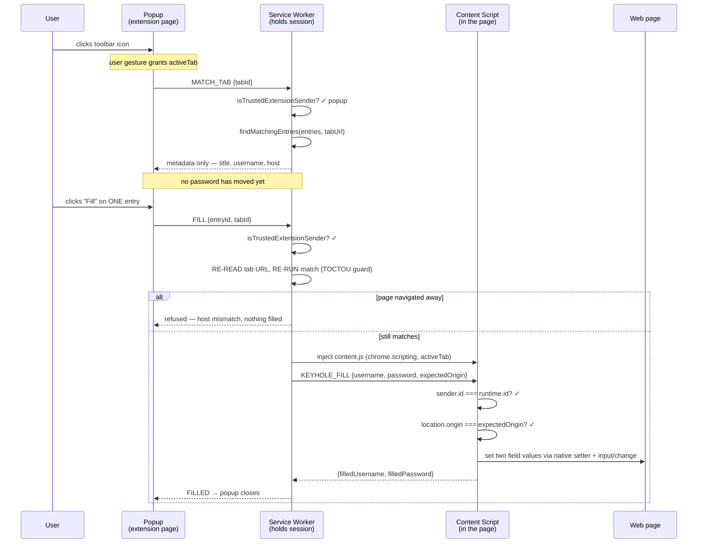
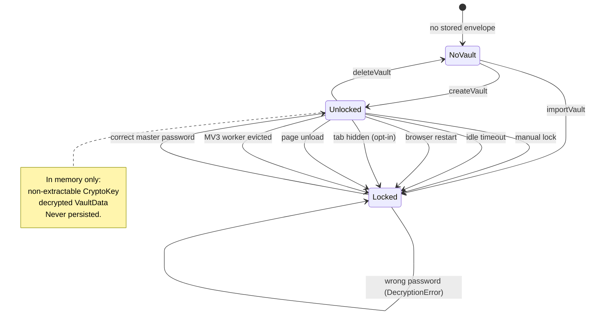

# Keyhole — Architecture

## Module layout

```mermaid
graph TD
  subgraph core["@keyhole/core — pure, no I/O"]
    crypto["crypto.ts<br/>Argon2id · AES-GCM · AAD"]
    vault["vault.ts<br/>create · unlock · save · re-key · CRUD"]
    types["types.ts"]
    validation["validation.ts<br/>zod schemas"]
    gen["password-gen.ts"]
    urlmatch["url-match.ts<br/>autofill matching"]
    totp["totp.ts<br/>RFC 6238"]
  end

  subgraph app["@keyhole/app — local web app"]
    useVault["useVault.ts<br/>lock state machine"]
    appStorage["storage.ts<br/>localStorage · File System Access"]
    appUI["React UI"]
  end

  subgraph ext["@keyhole/extension — Chrome MV3"]
    sw["service-worker.ts<br/>SOLE session holder"]
    popup["popup"]
    options["options page"]
    content["content/autofill.ts<br/>dependency-free"]
    extStorage["storage.ts<br/>chrome.storage.local"]
  end

  vault --> crypto
  vault --> validation
  vault --> types
  crypto --> types

  useVault --> vault
  useVault --> appStorage
  appUI --> useVault
  appUI --> gen
  appUI --> totp

  sw --> vault
  sw --> urlmatch
  sw --> totp
  sw --> extStorage
  popup -.messages.-> sw
  options -.messages.-> sw
  sw -.one credential.-> content

  style content fill:#3a1d1d,stroke:#c62828
  style sw fill:#1b3a2a,stroke:#1b7f47
```

`core` is imported by both apps and performs no I/O whatsoever — no `fetch`, no storage, no filesystem. That is what lets the same audited code back the web app and the extension, and what makes it exhaustively unit-testable.

---

## Encryption: what happens on create and unlock

```mermaid
sequenceDiagram
  participant U as User
  participant V as vault.ts
  participant C as crypto.ts
  participant S as Storage

  rect rgb(27, 58, 42)
  Note over U,S: CREATE
  U->>V: createVault("correct horse…")
  V->>C: deriveMasterKey(password, {salt, m=64MiB, t=3})
  Note right of C: Argon2id ≈ 105 ms
  C-->>V: Master Key (non-extractable CryptoKey)
  V->>C: generateVaultKeyBytes() → 32 random bytes (VEK)
  V->>C: encrypt(MK, VEK, aad = vaultId|version|kdf)
  C-->>V: wrappedKey {iv, ct+tag}
  V->>C: importAesKey(VEK) → non-extractable, then zeroize raw
  V->>C: encrypt(VEK, JSON(vaultData), aad = vaultId|version)
  C-->>V: payload {iv, ct+tag}
  V->>S: persist envelope (ciphertext + public header only)
  end

  rect rgb(58, 29, 29)
  Note over U,S: UNLOCK
  U->>V: unlockVault(file, password)
  V->>V: parseVaultFile — zod, strict, rejects unknown keys
  V->>V: reject formatVersion > supported
  V->>C: deriveMasterKey(password, file.kdf)
  Note right of C: KDF cost floor enforced here
  V->>C: decrypt(MK, wrappedKey, aad)
  alt GCM tag fails
    C-->>U: DecryptionError — the tag IS the password verifier
    Note over V: fail closed: payload never touched
  else tag verifies
    C-->>V: VEK bytes → import → zeroize
    V->>C: decrypt(VEK, payload, aad)
    V->>V: parseVaultData + migrate
    V-->>U: VaultSession {key, data}
  end
  end
```

The ordering is deliberate: the wrapped-key unwrap runs **before** the payload is touched, so a wrong password never begins decrypting entries.

---

## Autofill: the trust boundary

### Why a content script cannot extract the vault

```mermaid
graph LR
  CS["Content script<br/>(least trusted)"] -->|"any privileged request"| Gate{"isTrustedExtensionSender"}
  Popup["Popup / Options<br/>(extension pages)"] -->|"request"| Gate
  Evil["Another extension"] -->|"request"| Gate
  Web["Web page JS"] -->|"onMessageExternal"| Ext{"external handler"}

  Gate -->|"sender.tab set → ✗"| Deny["Unauthorized sender"]
  Gate -->|"wrong id → ✗"| Deny
  Gate -->|"non-extension URL → ✗"| Deny
  Gate -->|"all checks pass"| Allow["handle(request)"]
  Ext -->|"always"| Deny

  style CS fill:#3a1d1d,stroke:#c62828
  style Evil fill:#3a1d1d,stroke:#c62828
  style Web fill:#3a1d1d,stroke:#c62828
  style Deny fill:#3a1d1d,stroke:#c62828
  style Allow fill:#1b3a2a,stroke:#1b7f47
```

`sender.tab` is set by Chrome for anything running in a tab and cannot be forged from page JavaScript. Our own content script carries our extension id — so id alone is insufficient, and the `tab` check is what actually closes the hole. Covered by 10 tests in `extension/test/messages.test.ts`.

---

## Lock state

Every transition out of `Unlocked` discards the session. There is no path that leaves partial decrypted state behind — including the failure paths, where `mutate()` rolls the session back to its previous value so the UI and the session cannot diverge.

---

## Storage formats

Both apps read and write the identical `VaultFile` envelope, which is what makes export/import between them work with no conversion step.

```mermaid
graph TD
  VF["VaultFile (envelope)<br/>public header + 2 ciphertexts"]

  VF --> H["format, formatVersion, vaultId<br/>createdAt, updatedAt"]
  VF --> K["kdf: algorithm, memoryKiB,<br/>iterations, parallelism, salt, keyLength"]
  VF --> W["wrappedKey: iv + ct+tag"]
  VF --> P["payload: iv + ct+tag"]

  P -.decrypts to.-> VD["VaultData<br/>schemaVersion, entries[], folders[],<br/>settings, updatedAt"]
  VD --> E["Entry: id, title, username, password,<br/>urls[], notes, tags[], folderId,<br/>totpSecret, timestamps"]

  style H fill:#1b3a2a
  style K fill:#1b3a2a
  style W fill:#3a1d1d
  style P fill:#3a1d1d
  style VD fill:#3a1d1d
  style E fill:#3a1d1d
```

Green is stored in the clear (and authenticated as associated data). Red is ciphertext.

`schemaVersion` and `formatVersion` are versioned independently: the former describes the decrypted model and is migrated in `migrate()`, the latter describes the envelope and gates unlock entirely. Both reject newer-than-supported values with an actionable error rather than a generic parse failure.
